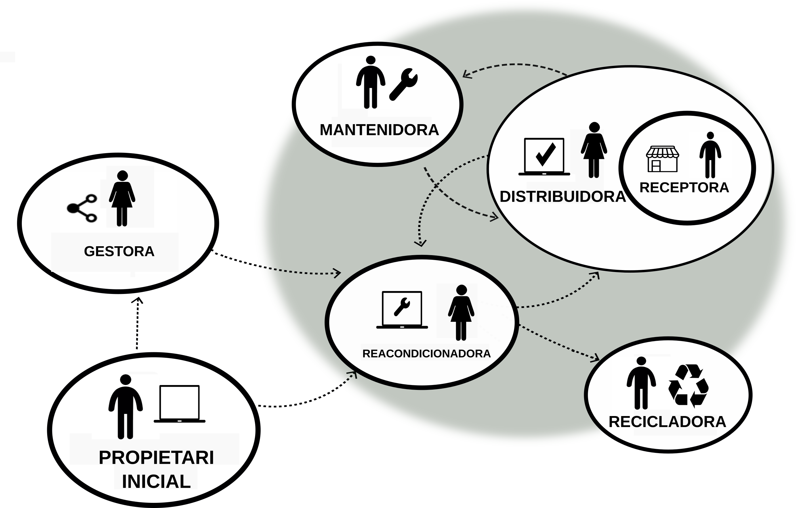

Llicència General d'un Circuit ProComú de Dispositius Digitals
============================================================
Llicència eReuse.org, Versió 1 Revisió 2, 25 d'Octubre 2022

## Principis Fonamentals

Un circuit segueix els Principis Fonamentals, que es faran servir d'inspiració en cas d'haver de resoldre qualsevol dubte sobre la interpretació del circuit. 

1. Ets lliure d'utilitzar el circuit per qualsevol propòsit en tant que no perjudiquis el seu funcionament, la llibertat dels altres usuaris, i respectis les condicions d'ús dels seus recursos.

2. Ets lliure de saber com és el Circuit, els seus recursos, com funciona, replicar-lo i difondre'n els seus principis i funcionament. 

3. Ets lliure d'incorporar recursos o crear nous circuits amb les condicions que vulguis.

4. Incorporant-te al Circuit, ajudes a estendre aquestes llibertats en les mateixes condicions.

## Definicions i consideracions

1. Un Circuit Comú de Dispositius Digitals, o *Circuit*, és un acord d'adhesió i explotació d'un sistema de recursos per promoure el consum responsable, col·lectiu i circular dels dispositius digitals, on aquests és compren, reparen, reutilitzen i reciclen de manera col·lectiva, tot garantint la traçabilitat, el reciclatge autoritzat i el impacte social que genera el seu ús en els seus múltiples cicles d'ús.

2. Un Circuit és una expressió de valors fonamentals com la llibertat, la sostenibilitat, la circularitat, la igualtat d'oportunitats, la solidaritat i la fraternitat, que promou el dret de tota persona a la seva alfabetització digital, i el dret ambiental i laboral d'explotar un recurs per evitar-ne el seu reciclatge prematur i en favor d'un ús responsable dels recursos. 

3. Un Circuit té com a propòsit extendre el temps de vida dels dispositius digitals que hi circulen a partir de i en ordre següent: la adquisició dels més circulars, la reparació, el reacondicionament, la preparació per a la reutilització, la reutilització, la traçabilitat i el reciclatge. 

4. Un dispositiu digital és circular si és durable, és viable la seva **reparació**, es troben **components de recanvi** a preus assequibles, és pot millorar/actualitzar amb **components**, permet un **diagnòstic** i una **identificació** única (possibilitant la **traçabilitat**), i és fàcil de desmantellar i de recuperar les matèries primeres (**reciclar**).

5. Un Circuit és d'accés i de participació oberta en quan els participants poden participar del seu desenvolupament, operacions i governança. El sistema de recursos conté (**dispositius, dades, eines i mètodes**), que cal preservar, sostenir i millorar. 

6. Un Circuit és un acord d'adhesió i explotació que es fa entre iguals, de cada participant amb el conjunt, i què és comú per a tothom que en forma part. Cada Circuit va lligat a una llicència específica que fa les funcions de contracte d'adhesió i de llicència d'ús del sistema de recursos, esdevenint així una garantia per qui subscriuen el Circuit (sobre quins són els termes i condicions aplicables).

## Participants.

 

### Entitats propeitaries inicials
Són les entitats donants d'equipament al Circuit.

### Entitats gestores:
Són les entitats que “arbitren” els Circuits; és a dir, són les entitats que formalitzen els convenis amb les donants i fan de paraigües entre les totes les altres participants. Les entitats gestores no reacondicionen o distribueixen equipament a les receptores, només reben els inventaris dels donants per compartir-los seguint uns criteris amb les entitats reacondicionadores i distribuidores. 

### Entitats reacondicionadores i distribuidores:
Són les entitats que reacondicionen i distribueixen els equips amb certificació de qualitat. 

### Entitats receptores:
Són les entitats que pròpiament reutilitzen l’equipament. Les entitats receptores participen indirectament del Circuit via les entitats reacondicionadores i distribuïdores, que són les que els transmeten la llicència d’ús dels recursos del procomú. 

## Condicions d’ús general del sistema de recursos.

Tot usuari del Circuit acorda el compliment dels principis i consideracions d’interès públic, social i ambiental indicades en els punts anteriors i es reconeix amb capacitat legal necessària per a obligar-se en representació de les respectives entitats a les que pertanyen, la subscripció del present acord, que es regirà pels següents requeriments i condicions d'ús general.

El Sistema de Recursos s’ha de preservar, sostenir i millorar:

1. Les dades que fan referència a la circularitat dels dispositius i dels participants han de ser fiables (generar confiança), han de compartir-se amb els donants i les receptores, i preferiblement s'han d'oferir en un format obert i intercanviable cap a altres circuits i el sistema de traçabilitat d'eReuse.org. 

2. Les eines de programari preferiblement han de ser en programari lliure, no crear dependències, tenir formats d'intercanvi en obert, i se'n ha de promoure la seva millora i aprenentatge.

3. Els procediments i certificats emprats han d'homogeneitzar-se, estandaritzar-se i han de generar dades i poder ser monitoritzats per permetre'n la seva millora continuada.

4. S'ha de respectar la privacitat de les receptores participants. 

5. Notificar a eReuse.org el circuit que es crea, els responsables, i vetllar per la transparència i qualitat de dades entre els participants del circuit i cap a eReuse.org; triar o definint la llicència de compartició de dades.
