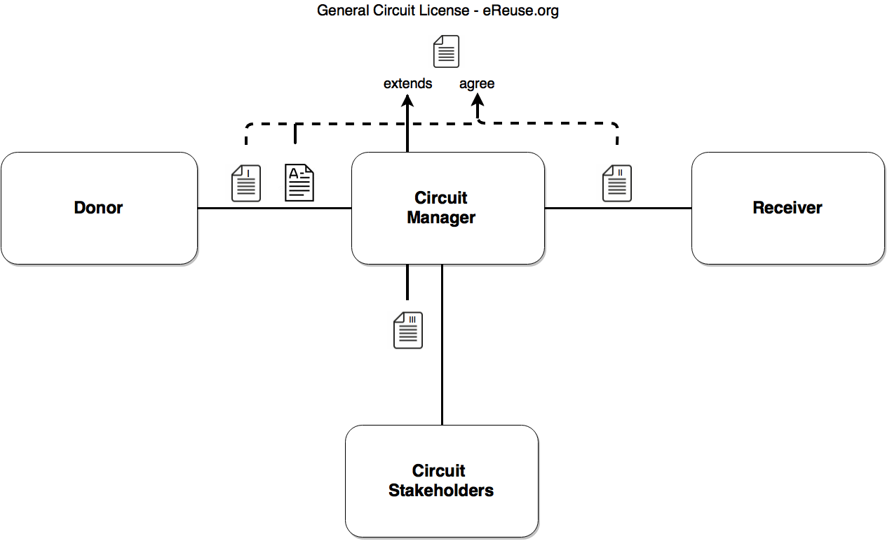

# Taula de continguts
1. Llicències Generals
2. Llicència d'un circuit de dispositius
2.1 CL-I - Conveni de cessió entre donant i gestora
2.2 CL-I-A Annex al conveni de cessió entre donant i gestora
2.2 CL-II Conveni de cessió entre gestora / grup interès i receptora
2.3 CL-III) Conveni de gestió del circuit

# Llicències Generals

 > Llicència d'àmbit general amb els principis, definicions i pactes d'àmbit general entre els grups d'interès. Els acords específics entre els grups d'interès s'inclouran preferentment en les llicències derivades. 

**(GCL) Llicència General d'un Circuit de Dispositius**

> Llicència d'àmbit general en el àmbit dels dispositius digitals  
> Estat: en desenvolupament la versió 1.0  
> Enllaç: [General-Circuit-License_CA.md](./0-GCL-General-Circuit-License/General-Circuit-Commons-License_CA.md)

**(GDL) Llicència General de Dades**

> Llicència d'àmbit general en el àmbit de les dades que es generen durant el cicle de vida dels dispositius que gestionen.  
> Estat: No iniciada  

# Llicència d'un circuit de dispositius

Està composta de tres convenis o documents principals:

 * I) el conveni de cessió de dispositius entre el donant i la gestora del Circuit i un annex al document I amb les especificitats del donant, 
 * II) (opcional) el conveni de cessió de dispositius entre el gestor i el receptor, i 
 * III) el conveni de gestió del circuit on es defineixen les normes de funcionament.

Els convenis on intervenen els donants són el I, les gestores en el I i si existeix la relació entre gestores i receptores també en el II,  i els grups d'interès (proveïdors, observadors, administració pública, voluntaris,...) en el III.

 

<!-- BR introduced to fit code with output-->

> Els documents I i II estan d'acord (agree) amb la [Llicència General de Circuit d'eReuse.org](./0-GCL-General-Circuit-License/General-Circuit-Commons-License_CA.md).

> Els documents Annex al I i II són una extenció de la llicència general i en (re)defineixen les normes de funcionament sense invalidar els principis i clàusules de la llicència general.

> Tot dispositiu sempre està vinculat a les obligacions amb el donant (document I) i obligacions amb el circuit (document III)

En el moment de fer una cessió del donant al gestor es crea un document tipus albarà que fa de **certificat de lliurament**, i on es fa referència a l'acord vigent entre les parts (documents I i III).
  
### (CL-I) Conveni de cessió entre donant i gestora

> Estat: en desenvolupament la versió 1.0  
> Enllaç: [CL-I-Agreement-Donor-to-Manager](./1-CL-Circuit-License/CL-I-Agreement-Donor-To-Manager-CAT.md)  

En aquest conveni el cedent (donant) transfereix les responsabilitats (ambientals, legals, ..) cap a la gestora. Seria similar a un conveni de cessió de béns. El signen el donant i la gestora. Es signen per periodes d'anys o sense data d'extinció i les parts poden finalitzar-lo en qualsevol moment. 

> Aquest conveni el signarien tots els donants que volen donar al circuit (aquesta signatura es pot realitzar en el moment que expresen la voluntat de donar). 

### (CL-I-A) Annex al conveni de cessió entre donant i gestora
> Estat: versió 1.0  
> Enllaç: [CL-I-Agreement-Donor-to-Manager-Annex-CAT](./1-CL-Circuit-License/CL-I-Agreement-Donor-To-Manager-Annex-CAT.md)

En un circuit participa més d'un donant i ténen voluntats diferents en referència a qui pot gestionar i reutilitzar els dispositius que donen, tot donant pot definir aquestes voluntats en un document **annex** al conveni I. En funció d'aquest annex els dispositius es donaran a uns o altres receptors, o podran accedir uns o altres proveïdors.

>  Si un donant vol incloure noves clàusules ho pot fer en un annex, sempre que una nova clàusula no invalidi la [Llicència General de Circuit d'eReuse.org](./0-GCL-General-Circuit-License/General-Circuit-Commons-License_CA.md).

### (CL-II) Conveni de cessió entre gestora/grup interès i receptora

> Estat: Finalitzat versió 1.0  
> Enllaç: [CL-I-Agreement-Manager-to-Receiver-Individual-ES](./1-CL-Circuit-License/CL-II-Agreement-Manager-To-Receiver-Individual-ES.md)  
> Enllaç: [CL-I-Agreement-Manager-to-Receiver-Individual-CAT](./1-CL-Circuit-License/CL-II-Agreement-Manager-To-Receiver-Individual-CAT.md)    
 
> **És un conveni opcional** que es dona en els circuits on l'equipament es presta a les receptores. En cas que la gestora o els grups d'interès comercialitzin (venta) l'equipament no es fa conveni, no obstant, en els termes i condicions de la venta es faria menció a la [Llicència General de Circuit d'eReuse.org](./0-GCL-General-Circuit-License/General-Circuit-Commons-License_CA.md).

El signen la gestora i la receptora, o en cas que la gestora ho delegui, el signen els grups d'interès (reacondicionadores, distribuidores i mantenedores) i les receptores. Es signen per periodes d'anys o sense data d'extinció i sempre les parts poden finalitzar-lo o una part excloures.

En el moment de rebre l'equipament es lliura un document albarà de lliurament (W) (Aquesta signatura s'ha de realitzar en el moment que la receptora ho rep doncs en el document consta la relació del inventari cedit).  

Aquest conveni pot tenir la forma jurídica de comodat que és un tipus de préstec gratuït, on la receptora cobreix els costos de fer el bé reutilitzable i té el compromís de retornar l'equipament a la gestora/grup d'interès un cop ja no en faci ús.

### (CL-III) Conveni de gestió del circuit

> Estat: Versió 1.0 Enllaç: [TODO]

En aquest conveni posem tot allò que afecta a la gestió i regula com resoldre situacions específiques o compromisos que poden variar en el temps. Un pacte descrit en aquest conveni no pot desactivar un pacte descrit en la Llicència General d'un Circuit.

***

## Com crear un fitxer odt o docx a partir d'un fitxer md (Markdown)
1.  Select the file
2.  Download de md (Markdown) document (remember click on raw)
3.  Conversion from markdown to odt: in command line "pandoc doc.md -o doc.odt
4.  Conversion from markdown to docx: in command line "pandoc -s -S doc.md -o doc.docx

More examples of conversion online (http://pandoc.org/demos.html#examples) or use Markdown Edit program.

