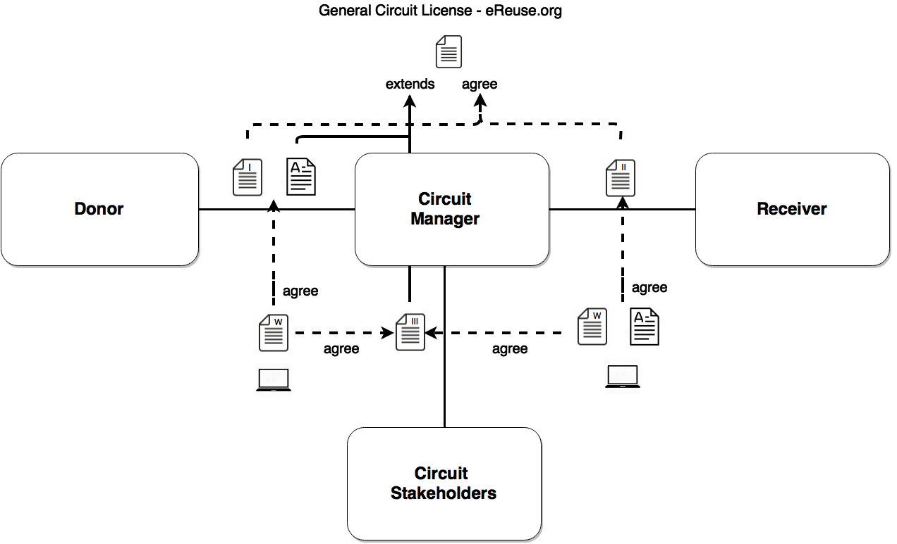

Llicències i convenis de transferència de béns:

## Llicències Generals

 > Llicència d'àmbit general amb els principis, definicions i pactes d'àmbit general entre els grups d'interès. Els acords específics entre els grups d'interès s'inclouran preferentment en les llicències derivades. 

#### (GCL) Llicència General d'un Circuit de Dispositius:

> Llicència d'àmbit general en el àmbit dels dispositius digitals  
> Estat: en desenvolupament la versió 1.0  
> Enllaç: [General-Circuit-License_CA.md](./0-GCL-General-Circuit-License/General-Circuit-License_CA.md)

#### (GDL) Llicència General de Dades

> Llicència d'àmbit general en el àmbit de les dades que es generen durant el cicle de vida dels dispositius que gestionen.  
> Estat: No iniciada  
> Enllaç: 

## Llicència de circuit

Està composta de tres documents:

 * I) el conveni de cessió de dispositius entre el donant i el gestor, i l'annex amb les especificitats del donant, 
 * II) el conveni de cessió de dispositius entre el gestor i el receptor, i
 * III) el conveni de gestió del circuit on es defineixen les normes de funcionament.

Els convenis on intervenen els donants són el I i l'annex, els gestors en el I, annex al I, II i III, els grups d'interès (proveïdors, observadors, administració pública, voluntaris,...) el III i els receptors en el II. 

 

<!-- BR introduced to fit code with output-->

> Els documents I i II accepten la [Llicència General de Circuit d'eReuse.org](./0-GCL-General-Circuit-License/General-Circuit-License_CA.md).

> Els documents Annex al I i III són una extenció de la llicència general i en (re)defineixen les normes de funcionament sense invalidad els principis i clàusules de la llicència general.

> Un dispositiu està vinculat a un document tipus II, obligacions del donant, i a un document tipus III, obligacions dels grups d'interès. 

* Tot dispositiu té una llicència que depen de la combinació de les restriccions dels documents commentats i descrits en més detall a continuació. *

  
### (CL-I) Conveni de cessió entre donant i gestor 

> Estat: en desenvolupament la versió 1.0  
> Enllaç: [CL-I-Agreement-Donor-to-Manager](./1-CL-Circuit-License/CL-I-Agreement-Donor-To-Manager.md)  
> Enllaç: [CL-I-Agreement-Donor-to-Manager ANNEX](./1-CL-Circuit-License/CL-I-Agreement-Donor-To-Manager-Annex.md)

En aquest conveni el cedent (donant) transfereix les responsabilitats (ambientals, legals, ..) cap al gestor. Seria similar a un conveni de cessió de béns. El signen el donant i el gestor. Es signen per periodes d'anys o sense data d'extinció i les parts poden finalitzar-lo en qualsevol moment. 

En un circuit participa més d'un donant i ténen voluntats diferents en referència a qui pot gestionar i reutilitzar els dispositius que donen, per ex: "el receptor només pot ser una entitat sense ànim de lucre", etc... cada donant defineix aquestes voluntats en un document **annex** al conveni I. En funció d'aquest annex els dispositius es donaran a uns o altres receptors o els  

> Aquest conveni el signarien tots els donants que volen donar al circuit (Aquesta signatura es pot realitzar en el moment que expresen la voluntat de donar). 
> Si un donant vol incloure noves clàusules ho pot fer en un annex, sempre que una nova clàusula no invalidi les dels documents II i III.

### (CL-II) Conveni de cessió entre gestor i receptor

> Estat: en desenvolupament la versió 1.0  
> Enllaç: [CL-I-Agreement-Manager-to-Receiver-NotForProfit](./1-CL-Circuit-License/CL-II-Agreement-Manger-To-Receiver-NotForProfit.md)  
> Enllaç: CL-I-Agreement-Manager-to-Receiver-ForProfit (en desenvolupament) 

El signen el gestor i el receptor. Es signen per periodes d'anys o sense data d'extinció i sempre les parts poden finalitzar-lo o una part excloures.

> Aquest conveni el signarien tots els receptors que volen rebre del circuit (Aquesta signatura es pot realitzar en el moment que l'entitat presenta el primer projecte).  

### (CL-III) Conveni de gestió entre Grups d'Interès o Llicència del comú.

> Estat: en desenvolupament la versió 1.0 

En aquest conveni posem tot allò que afecta a totes les parts i regula com resoldre situacions específiques o compromisos que poden variar durant la vigència del conveni del donant. Un pacte descrit en aquest conveni no pot desactivar un pacte descrit en la llicència.

Els dispositius que arriben al comú procedeixen de donants o d'latres circuits tal i que aniran lligats a uns compromissos assumits en els documents I i Annex, i document II, tal que un comú ha de respectar aquests compromisos i fer-los prevaldre. 

> Suposem que un donant vol donar un dispositiu que va rebre d'un altre circuit (li direm circuit X), si    un dispositius procedent d'un altre circuit (X), i aquest obliga al receptor a portar-lo a un punt verd, el gestor del comú haurà d'avisar al donant de que només pot donar el dispositius si  

> En el cas d'implementació d'un transferhub aquest conveni el signarien els receptors en el moment de rebre el dispositius. Pot passar que un receptor tingui dispositius amb diferents pactes tipus III (i també tipus II). Per exemple suposem que un receptor rep d'un donant públic i de un refabricador, l'equip del doannt públic no el podrà vendre i en canvi si podrà vendre l'equip del refabricador. Aquests pactes (o restriccions) aniran relfexades a l'etiqueta o seran visibles via realitat aumentada al llegir-se el codi QR.

## (DL) Llicències de Dades
> Les parts aporten dades a eReuse.org segons la tipologia i es defineixen almenys tres tipus de llicència segons el contingut de les dades aportades

##### DL.1 - Profit - Product and component: durability (technical and Hardware ID).
##### DL.2 - Planet - Device Traceability: DCP, transferred organization (not if is a final customer social or not social) and disposal.
##### DL.3 - People - Social Impact of reuse: social receivers and impact (only if receiver is agreed with this license).

TODO.
 * Definir llicència DL.1
 * Definir llicència DL.2
 * Definir llicència DL.3* 

## How to create odt or docx file
1.  Select the file
2.  Download de md (Markdown) document (remember click on raw)
3.  Conversion from markdown to odt: in command line "pandoc doc.md -o doc.odt
4.  Conversion from markdown to docx: in command line "pandoc-s -S doc.md -o doc.docx

More examples of conversion online (http://pandoc.org/demos.html#examples) or use Markdown Edit program.

